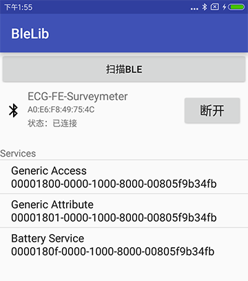

# **BleLib** #

BleLib 是 Android 低功耗蓝牙 4.0 及以上开发的辅助库，一行代码解决 Ble 初始化、扫描、连接、特性读写、设置通知等操作。 

BleLib 中的关键类：
  
- BleService 是单个 Ble 连接操作的服务类  
- GattAttributes 类中包含了蓝牙联盟规定的服务和特征的 UUID 值
- MultipleBleService 类是可多个蓝牙设备同时连接的服务类


## **Screenshots** ##

 


## **Usage** ##

可看博客： [使用 BleLib 的轻松搞定 Android 低功耗蓝牙 Ble 4.0 开发详解](http://blog.csdn.net/kjunchen/article/details/50909410)

## **引入** ##
BleLib 库已上传至 jcenter、maven central 仓库  
因此，在你项目 Module 中的 build.gradle 文件中添加库依赖即可，如下：  
Gradle:

```.gradle
dependencies {
    compile 'com.junkchen.blelib:blelib:1.2.4'
}
```

只此一句即可使用 BleLib 库，方便吧，要的就是这效果。  

BleLib 中的 Ble 继承了 Service，因此建议绑定服务进行使用。  
  
```.java
private BleService mBleService;
private boolean mIsBind;
private ServiceConnection serviceConnection = new ServiceConnection() {
        @Override
        public void onServiceConnected(ComponentName name, IBinder service) {
            mBleService = ((BleService.LocalBinder) service).getService();
            if (mBleService != null) mHandler.sendEmptyMessage(SERVICE_BIND);
            if (mBleService.initialize()) {
                if (mBleService.enableBluetooth(true)) {
                    mBleService.scanLeDevice(true);
                    Toast.makeText(BleScanActivity.this, "Bluetooth was opened", Toast.LENGTH_SHORT).show();
                }
            } else {
                Toast.makeText(BleScanActivity.this, "not support Bluetooth", Toast.LENGTH_SHORT).show();
            }
        }

        @Override
        public void onServiceDisconnected(ComponentName name) {
            mBleService = null;
            mIsBind = false;
        }
    };


private void doBindService() {
Intent serviceIntent = new Intent(this, BleService.class);
bindService(serviceIntent, serviceConnection, Context.BIND_AUTO_CREATE);
}

private void doUnBindService() {
if (mIsBind) {
    unbindService(serviceConnection);
    mBleService = null;
    mIsBind = false;
}
}
```

当服务绑定后就可以进行如下操作了：   

```.java
mBleService.initialize();//Ble初始化操作  
mBleService.enableBluetooth(boolean enable);//打开或关闭蓝牙  
mBleService.scanLeDevice(boolean enable, long scanPeriod);//启动或停止扫描Ble设备  
mBleService.connect(String address);//连接Ble  
mBleService.disconnect();//取消连接  
mBleService.getSupportedGattServices();//获取服务  
mBleService.setCharacteristicNotification(BluetoothGattCharacteristic characteristic,
boolean enabled);//设置通知  
mBleService.readCharacteristic(BluetoothGattCharacteristic characteristic);//读取数据  
mBleService.writeCharacteristic(BluetoothGattCharacteristic characteristic, byte[] value);//写入数据 
 ```

设置监听回调接口，获取相应返回数据，获取扫描Ble结果、连接等操作也可以以接收广播的方式获取，但我个人觉得用监听的方式更好，广播有的值无法传递，而接口传递过来的是原始数据，在我的样例中有使用广播来接收扫描的结果和连接状态的改变。 
  
```.java
//Ble扫描回调
mBleService.setOnLeScanListener(new BleService.OnLeScanListener() {
@Override
public void onLeScan(BluetoothDevice device, int rssi, byte[] scanRecord) {
    //每当扫描到一个Ble设备时就会返回，（扫描结果重复的库中已处理）
}
});
//Ble连接回调
mBleService.setOnConnectListener(new BleService.OnConnectListener() {
    @Override
    public void onConnect(BluetoothGatt gatt, int status, int newState) {
        if (newState == BluetoothProfile.STATE_DISCONNECTED) {
            //Ble连接已断开
        } else if (newState == BluetoothProfile.STATE_CONNECTING) {
            //Ble正在连接
        } else if (newState == BluetoothProfile.STATE_CONNECTED) {
            //Ble已连接
        } else if (newState == BluetoothProfile.STATE_DISCONNECTING) {
            //Ble正在断开连接
        }
    }
});
//Ble服务发现回调
mBleService.setOnServicesDiscoveredListener(new BleService.OnServicesDiscoveredListener() {
    @Override
    public void onServicesDiscovered(BluetoothGatt gatt, int status) {

    }
});
//Ble数据回调
mBleService.setOnDataAvailableListener(new BleService.OnDataAvailableListener() {
    @Override
    public void onCharacteristicRead(BluetoothGatt gatt, BluetoothGattCharacteristic characteristic, int status) {
        //处理特性读取返回的数据
    }

    @Override
    public void onCharacteristicChanged(BluetoothGatt gatt, BluetoothGattCharacteristic characteristic) {
        //处理通知返回的数据
    }
});
```

## **Release Notes** ##

- **blelib-1.2.4**（2017-05-31）
  
  - 修复上个版本未解决的 bug，并优化代码。
 	

- **blelib-1.2.3**（2016-09-23）

    - 修复扫描结果返回时出现空指针的 bug 。


- **blelib-1.2.2**（2016-09-08）

    - 修复调用 scanLeDevice(false) 不能停止扫描的 bug 。


- **blelib-1.2.1**（2016-07-30）
	
	- 添加了 readDescriptor() 、 readRemoteRssi() 和 requestMtu()三个方法。上个版本中添加了相应的接口而没有添加方法。
	

- **blelib-1.2.0**（2016-05-21）
	
	- 新增两个接口 OnReadRemoteRssiListener 和  OnMtuChangedListener 。
	
	- 在 OnDataAvailableListener 接口中新增 onDescriptorRead() 方法 。

  
## **Reference** ##

[https://developer.android.com/guide/topics/connectivity/bluetooth-le.html](https://developer.android.com/guide/topics/connectivity/bluetooth-le.html)


## **License** ##

BleLib is released under the [Apache 2.0 license](http://www.apache.org/licenses/LICENSE-2.0).

```.html
Copyright 2016 Junk Chen.

Licensed under the Apache License, Version 2.0 (the "License");
you may not use this file except in compliance with the License.
You may obtain a copy of the License at

    http://www.apache.org/licenses/LICENSE-2.0

Unless required by applicable law or agreed to in writing, software
distributed under the License is distributed on an "AS IS" BASIS,
WITHOUT WARRANTIES OR CONDITIONS OF ANY KIND, either express or implied.
See the License for the specific language governing permissions and
limitations under the License.
```
